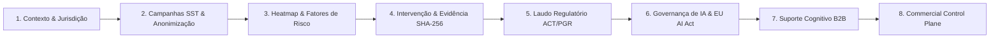

# AEGISHUB AI — P6.7 DEMO RUNBOOK (GUIA EXECUTIVO DE APRESENTAÇÃO)
**Documento:** `P6_7_DEMO_RUNBOOK.md`  
**Data:** 17 de Agosto de 2026  
**Público-Alvo:** Executivos, Diretores de SST/RH, DPOs, Auditores e Clientes Enterprise  
**Duração da Apresentação:** 10 a 15 Minutos

---

## 1. Princípios Fundamentais da Demonstração
1. **Zero Dados Reais:** Todos os dados, nomes de colaboradores, taxas fiscais e laudos apresentados são 100% sintéticos e gerados determinísticamente.
2. **Ambiente Seguro:** Controles de produção impedem reset ou contaminação de tenants reais (`assertDemoEnvironmentAllowed`).
3. **Multi-Jurisdição:** Apresentações personalizadas para **Portugal (Lei 102/2009 / ACT / EUR)** e **Brasil (NR-1 / GRO / PGR / MTE / BRL)**.

---

## 2. Organizações e Contas de Demonstração

### 🇵🇹 Portugal — Lusitana Logística & Serviços, Lda. (DEMO)
- **Slug:** `demo-lusitana-logistica`
- **Jurisdição:** Portugal (ACT / Lei 102/2009 / EUR)
- **Plano Comercial:** Professional (100 seats, IA Governance, Suporte Cognitivo)
- **Usuários:**
  - **Admin:** `admin.pt@demo.invalid`
  - **RH:** `rh.pt@demo.invalid`
  - **SST Professional:** `sst.pt@demo.invalid`
  - **Manager:** `manager.pt@demo.invalid`
  - **Auditor / DPO:** `auditor.pt@demo.invalid`

### 🇧🇷 Brasil — Paulista Indústria & Tecnologia S/A (DEMO)
- **Slug:** `demo-paulista-industria`
- **Jurisdição:** Brasil (MTE / NR-1 / GRO / PGR / BRL)
- **Plano Comercial:** Enterprise (1.000 seats, API Access, Governança Total)
- **Usuários:**
  - **Admin:** `admin.br@demo.invalid`
  - **RH:** `rh.br@demo.invalid`
  - **SST Professional:** `sst.br@demo.invalid`
  - **Manager:** `manager.br@demo.invalid`
  - **DPO / Compliance:** `dpo.br@demo.invalid`

---

## 3. Roteiro Executivo de Apresentação (10–15 Minutos)



### ⏱️ Minuto 01–03: Acesso, Organização e Isolamento Multi-Tenant
1. Acesse o sistema e selecione a organização demo através do **Organization Switcher** (P3).
2. Mostre o **Demo Banner** de proteção visual no topo da tela.
3. Demonstre a adaptação imediata da moeda, autoridade e legislação (ACT / EUR para Lisboa ou MTE / BRL para São Paulo).

### ⏱️ Minuto 03–06: Campanhas Ocupacionais e Heatmap Anonimizado
1. Navegue para o painel de **Campanhas SST** (`/rh`).
2. Apresente a campanha ativa com taxa de adesão superior a 85% ($N \ge 20$).
3. Mostre o **Heatmap de Riscos Ergonômicos e Psicossociais** destacando que setores com $N < 5$ são mascarados automaticamente pelo motor de anonimização (k-anonymity).

### ⏱️ Minuto 06–08: Plano de Intervenção e Evidência Criptográfica
1. Acesse o **Intervention Engine** (P2.2).
2. Abra a ação corretiva *"Otimização de Escalas e Redução de Sobrecarga Noturna"*.
3. Mostre o documento de evidência anexado com **hash SHA-256**, carimbo temporal e status de reavaliação (*Effective*).

### ⏱️ Minuto 08–10: Emissão do Laudo Regulatório (ACT / NR-1)
1. Acesse o **Compliance Reporting Engine** (P2.3).
2. Abra o laudo regulatório gerado.
3. Destaque a estrutura legal em conformidade com o Artigo 15 da Lei 102/2009 (PT) ou com o Inventário de Riscos do PGR / NR-1 (BR).

### ⏱️ Minuto 10–12: Governança de IA (EU AI Act) & Incident Response
1. Abra a central de **AI Governance** (`/admin/ai-pilot`).
2. Mostre o **Model Registry** com o modelo `AegisHub Demo Risk Model (v1.0)`.
3. Apresente a fila de **Supervisão Humana (Human Oversight)** e o histórico de um incidente de IA investigado e mitigado com trilha imutável (P6.3).

### ⏱️ Minuto 12–14: Suporte Cognitivo Neurodivergente (B2B Benefit)
1. Acesse o **Cognitive Support Workspace** (`/employee/cognitive`).
2. Mostre a decomposição executiva de tarefas sem qualquer coleta ou exposição de dados clínicos, diagnósticos ou CID/DSM (P5 & P6.2).

### ⏱️ Minuto 14–15: Commercial Control Plane & Quotas
1. Abra o **Commercial Console** (`/admin/commercial`).
2. Mostre o consumo real de licenças (Seats), campanhas, laudos e requisições de IA em tempo real com thresholds de alerta (*Normal, Warning, Critical, Exceeded*).

---

## 4. Instruções de Provisionamento e Reset

### Para provisionar os dados sintéticos via código / CLI:
```typescript
import { seedDemoPortugal, seedDemoBrazil } from "@mindops/database";

// Seed de Portugal
await seedDemoPortugal(supabaseClient);

// Seed do Brasil
await seedDemoBrazil(supabaseClient);
```

### Para resetar com segurança (apenas tenants `demo-*`):
```typescript
import { resetDemoTenant } from "@mindops/database";

await resetDemoTenant(supabaseClient, "demo-lusitana-logistica");
await resetDemoTenant(supabaseClient, "demo-paulista-industria");
```
